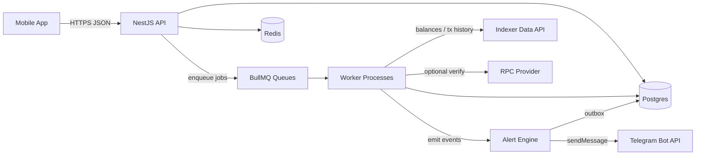

# Architecture

## Repository Topology

Recommended target structure:

```text
/
  apps/
    api/                # NestJS HTTP API
    worker/             # BullMQ workers
    mobile/             # Expo React Native app
  packages/
    shared/             # shared TS types and schemas
    ui/                 # optional shared UI
    config/             # eslint / tsconfig / prettier presets
  infra/
    docker/             # docker-compose for local dependencies
    migrations/         # SQL or ORM migrations
```

Recommended workspace tool: Nx.

Rationale:

- one repository for backend, worker, and mobile,
- shared contracts across API and app,
- consistent lint and build rules,
- easier CI and incremental builds.

## Backend Module Map

Target logical modules:

- `ConfigModule`: validated environment configuration.
- `DatabaseModule`: Postgres connection and migrations.
- `AuthModule`: Telegram linking and JWT sessions.
- `WalletsModule`: CRUD and sync state.
- `PortfolioModule`: snapshots, aggregation, cached read models.
- `TransactionsModule`: transaction and transfer history.
- `AlertsModule`: rules, event evaluation, anti-duplicate logic.
- `NotificationsModule`: Telegram sender and notification outbox.
- `IntegrationsModule`: provider adapters.
- `JobsModule`: queues, workers, schedulers.

## Mobile Stack

Target mobile stack:

- Expo + React Native (TypeScript),
- TanStack Query for server state,
- Expo Router or React Navigation,
- light component library plus custom UI.

Suggested MVP screens:

- onboarding and Telegram linking,
- wallet list and add wallet,
- portfolio summary,
- token list,
- transaction feed,
- alert rules.

## High-Level Data Flow



Critical rule:

- Alerts should be created as a result of background processing over newly ingested data.
- Alerts should not be emitted directly from a user-facing HTTP request.

## Critical User Flow

Target sequence for adding a wallet:

1. User calls `POST /wallets`.
2. API stores the wallet and initial sync state.
3. API enqueues `sync.init(walletId)`.
4. Worker fetches balances and transaction history.
5. Worker upserts balances, transactions, and transfers.
6. Worker enqueues `alerts.evaluate(walletId, newTxIds)`.
7. Alerts job resolves matching rules and inserts unique alert events.
8. Notification job sends Telegram messages through the outbox.

## On-Chain Data Strategy

The sync layer should rely on two sources:

- `Indexer/Data API`: balances, transfers, transaction history, and pricing.
- `RPC Provider`: targeted balance checks, sanity checks, and fallback.

The recommended default stance is:

- use the indexer for bulk reads,
- use RPC only where precision or fallback is needed.

## Finality And Reorg Handling

The target design assumes that fresh blocks may still be reorged.
The minimal safe approach for a read-only tracker is:

- store `confirmations_required` per wallet,
- compute `safeTip = chainTip - confirmations_required`,
- only finalize records and alerts up to `safeTip`,
- rescan a recent reorg window on every incremental sync,
- compare `block_hash` for already stored heights,
- replace or mark orphaned data if the hash changes.

The state needed for this belongs in `wallet_sync_state`.

## BullMQ Queues

### Queue: `sync`

`sync.init`

- Payload: `{ walletId, mode: "full" }`
- Retries: 5
- Backoff: exponential
- Work:
  - fetch balances,
  - create a portfolio snapshot,
  - fetch transaction history,
  - upsert transactions and transfers,
  - persist provider cursor or block state.

`sync.incremental`

- Payload: `{ walletId }`
- Triggered by a scheduler for active wallets.
- Work:
  - load sync state,
  - determine safe range or provider cursor,
  - fetch new data,
  - upsert changes,
  - collect new transaction IDs,
  - enqueue `alerts.evaluate`.

### Queue: `alerts`

`alerts.evaluate`

- Payload: `{ walletId, txIds }`
- Work:
  - load enabled rules,
  - classify activity,
  - insert unique alert events,
  - create `notification_outbox` rows.

### Queue: `notifications`

`notifications.telegram.send`

- Payload: `{ outboxId }`
- Work:
  - load outbox row,
  - call Telegram `sendMessage`,
  - mark `sent` on success,
  - if Telegram returns `retry_after`, mark `delayed` and set `not_before`,
  - otherwise increment attempts and retry with backoff.

## Transaction Classification

Two valid implementation paths exist.

### Path A: Use Provider Categorization

Use provider-native categories when the provider returns normalized wallet history.
Application logic maps provider categories to internal enums.

### Path B: Classify Internally

Use transaction fields and decoded transfer logs to derive:

- `direction`: `in`, `out`, `self`, or `unknown`,
- `category`: `transfer`, `contract_call`, `swap_like`, and so on.

For MVP, a practical heuristic is:

- `in`: `to_address == wallet`,
- `out`: `from_address == wallet`,
- `self`: both match,
- `transfer`: non-zero native value or ERC-20 `Transfer`,
- `contract_call`: likely contract destination with zero native value.

## Provider Abstraction

The implementation should hide provider specifics behind adapters:

- `IndexerProvider`
- `RpcProvider`
- `PriceProvider`

The adapter boundary matters because pricing, credit models, and limits change over time.
The application must be able to swap providers without rewriting business logic.
